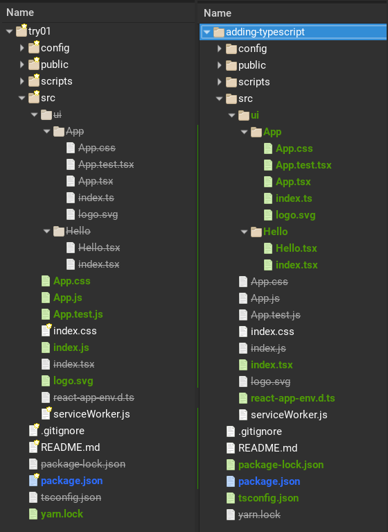

#3

There are different ways to get started with Raact and TypesScript.

You can follow the directions on [the React documents site](https://reactjs.org/docs/static-type-checking.html#typescript) which offers two options, 1) using Create React App, 2) Doing it manually. The latter method probably isn't what you want since it doesn't include Webpack or other build system.

When using Create React App the instructions seem to say, to me at least, just do

```js
$ npx create-react-app my-app-name --typescript
```

I wondered how this modified the generic/straight Create React App so I did ...

```js
$ npx create-react-app cra-straight
$ cd cra-straight
$ yarn eject
// then
$ npx create-react-app cra-typescript --typescript
$ cd cra-typescript
$ yarn eject
```
... and then compared the two projects using [Meld](http://meldmerge.org/)

The comparison showed no difference. cra-typescript didn't even have the typescript package in package.json, so I'm not sure what is going on here. Maybe my mistake.

Next I used TypeScript Starter as a base to modify cra-typescript

```js
$ cp -r cra-typescript cra-add-typescript
```


# ********
# OLDER
# ********

After following the [directions for adding TypeScript to Create React App](https://reactjs.org/docs/static-type-checking.html#adding-typescript-to-a-project) there seemed room for improvement. I got some initial errors and I also wanted to add some things that I'm used to using when working on non-TypeScript projects. The below is notes on my journey, somewhat organized like a tutorial, but not fully vetted as such yet (today 12-Mar-19).

> It seems odd that Create React App puts dev dependencies in 'depenencies' and not 'devDependencies' in package.json. For an explanation see [comment by gaearon](https://github.com/facebook/create-react-app/issues/1764#issuecomment-285082921).

Not sure if I did something wrong but I got over 30 warnings when using Yarn to add TypeScript and related type definitions my project. Most worrisome of them was a message about packages being removed because they were not installed by me. Since I generally use [npm]() anyway, I switched to npm and got no warnings.
- This same error happens if you use npm immediately following npx create-react-app --typescript. To get around this, delete both /node_modules and yarn.lock before running any npm commands.

The below is from Create React App [documentation](https://facebook.github.io/create-react-app/docs/adding-typescript), except that it deletes yarn.lock & node_modules and reinstalls using npm.


## Create the app
```js
npx create-react-app adding-typescript --typescript
```

## Eject
Ejecting the project will allow you to see all files and folders in your project as well as all packages being used. Much of this is hidden by Create React App before ejecting. I have not tried using the project without ejecting but see no reason why this would not work.

```js
// from project root
npm run eject
```

Here is a comparison of what the project looks like after ejecting vs the final project. Don't make any changes yet, the project will evolve as you follow the steps that follow.



## Swith out Yarn for npm
As mentioned, I got over 30 warnings when I tried to use Yarn so I swapped it out form npm and got no warnings.
```js
cd adding-typescript
rm yarn.lock
rm -rf node_modules
npm i
```

### Quick test
Start the app and see if it loads.
```js
npm start
```

## Commit changes
Before making more changes, commit what is already working.
```js
git add .
git commit -m 'switched to npm'
```

## Install TypeScript and related type definitions
Even though we used the `--typescript` flag with Create React App, you need to add TypeScript yourself. You will also want to add several TypeScript definition files as listed below.
```js
npm i -S typescript @types/node @types/react @types/react-dom @types/jest
```

## Rename src/index.js to src/index.tsx
When using TypeScript, React files need a `.tsx` extension.
```js

mv src/index.js src/index.tsx
```


## Quick test
Run a quick test. In the browser, everthing should look the same as last time you ran it.
```js
npm start
```

## Commit changes
```js
// back to root directory
cd ..
git add .
git commit -m 'typescript added'
```

## Add Enzyme and realted packages
We will be using Enzyme for writing tests. Execute the below command to add all the related packages
```js
npm i -D enzyme enzyme-adapter-react-16 jest-environment-enzyme jest-enzyme @types/enzyme @types/enzyme-adapter-react-16
```

## Add configuration for Jest & Enzyme
Make the following changes in package.json. You can read more about these changes
- here
- here

Under 'jest'
```json
"jest": {
  "setupTestFrameworkScriptFile": "jest-enzyme",
  ...
  - "testEnvironment": "jsdom"
  + "testEnvironment": "enzyme"
  + "testEnvironmentOptions": {
  +   "enzymeAdapter": "react16"
  + },
  ...
}

```


## tsconfig.json
`tsconfig.json`, as the name implies, is used to configure TypeScript.

```js
// in project root
touch tsconfig.json
```

```js
- "jsx": "es5"
+ "jsx": "react"
...
// changes seem wrong so investigate
"lib": [
- "dom.iterable"
- "esnext"
+ "es6"
+ "dom"
],
//
+ "baseURL": "src"

// Optional rules but recommende
+ "noImplicitReturns": true,
+ "noImplicitThis": true,
+ "noImplicitAny": true,
+ "importHelpers": true,
+ "strictNullChecks": true,
+ "suppressImplicitAnyIndexErrors": true,
+ "noUnusedLocals": true


```


## Commit changes due to comparison
**no actual change**
```js
git add .
git commit -m 'reordered tsconfig'
```

## Rename UI files
In TypeScript
- files with jsx files are .tsx
- regular .js files are .ts

```js
cd src
mv App.js App.tsx
mv App.test.js App.test.tsx
```

## Current project structure
<picture Selection_04g>

## Run it
```js
npm start
```

## Run tests
```js
npm test
```
<picture Selection_046>

## Reorg project structure
The current structure from Create React App is good for a quick example, but something a bit different is needed for a larger project.
I'm making these changes in a file manager
1. create directory /src/ui - this will be used for all unique UI components
1. create directory /src/ui/App - yes, capital 'A'
1. move App.css, App.test.tsx, App.tsx & logo.svg to /src/ui
1. create file /src/ui/App/index.ts
```js
export { default } from './App'
```
1. modify src/index.ts
```js
- import App from './App'
+ import App from './ui/App'
```

TypeScript also uses [Type assertions](https://github.com/Microsoft/TypeScript-React-Starter#type-assertions). Modify index.ts to be
```js
ReactDOM.render(
  <App />,
  document.getElementById('root') as HTMLElement
);
```
See [Type assertions](https://github.com/Microsoft/TypeScript-React-Starter#type-assertions) for why.

1. while here, if you don't intend to use the service worker remove it and delete src/serviceWorker.js


## Run tests then app to make sure all is good
```js
npm test
npm start
```


## New Structure
<picture Selection_047.png>


## Using absolute imports for components
Create another component and import it with an absolute reference
1. create folder src/ui/Hello
1. in Hello create files Hello.tsx & index.ts

```js
// Hello.tsx

import React from 'react'

const Hello = () => {
  return <h1>Hello</h1>
}

export default Hello
```

```js
// index.ts
export { default } from './Hello'
```

Modify
```js
// App.tsx

import React, { Component } from 'react';
import logo from './logo.svg';
import './App.css';
+ import Hello from '../Hello'

class App extends Component {
  render() {
    // Test stuff
    var a = 1
    let b = 2
    const c = 3
    const d = true

    return (
      <div className="App">
        
        <header className='App-header'>
+         <Hello />
          
          <p>
            Edit <code>src/App.js</code> and save to reload.
          </p>
          <a
            className="App-link"
            href="https://reactjs.org"
            target="_blank"
            rel="noopener noreferrer"
          >
            Learn React
          </a>
        </header>
      </div>
    );
  }
}

export default App;

```

```js
npm start
```

This gives a surprising error
```js
TypeScript error: Cannot compile namespaces when the '--isolatedModules' flag is provided.  TS1208
```
The cure is to rename Hello/index.ts to index.tsx


## To Do
"exclude": [
    "src/serviceWorker.js"
  ]

## Resources

- https://piotrwitek.github.io/react-redux-typescript-guide/#fcspreadattributes

- https://basarat.gitbooks.io/typescript/content/docs/project/compilation-context.html

## Appendix
## Starter vs. Create React App
### package.json

### Starter has added packages
- @types/enzyme
- @types/enzyme-adapter-react-16
- enzyme
- enzyme-adapter-react-16
- jest-environment-enzyme
- jest-enzyme

### Under "jest"
"testEnvironment": "jsdom"
"setupTestFrameworkScriptFile": "jest-enzyme",
"testEnvironment": "enzyme",
"testEnvironmentOptions": {
  "enzymeAdapter": "react16"
},

> Note
> babel - cra is using @babel/core": "7.2.2" with babel-core": "7.0.0-bridge.0 (leave as is)

## tsconfig.json differences
| field | starter | cra |
| ----- | ------- | --- |
| jsx | react | preserve |
| lib | dom, es6 | esnext, dom, dom.iterable |
| skipLibCheck | n/a | true |
| allowSyntheticDefaultImports | n/a | true |
| resolveJsonModule | n/a | true |
| isolatedModules | n/a | true |
| noEmit | n/a | true |
| include | n/a | src |
| baseUrl | src | n/a |
| outDir | build/dist | n/a |
| sourceMap | true | n/a |
| rootDir | src | n/a |
| noImplicitReturns | true | n/a |
| noImplicitThis | true | n/a |
| noImplicitAny | true | n/a |
| importHelpers | true | n/a |
| strictNullChecks | true | n/a |
| suppressImplicitAnyIndexErrors | true | n/a |
| noUnusedLocals | true | n/a |