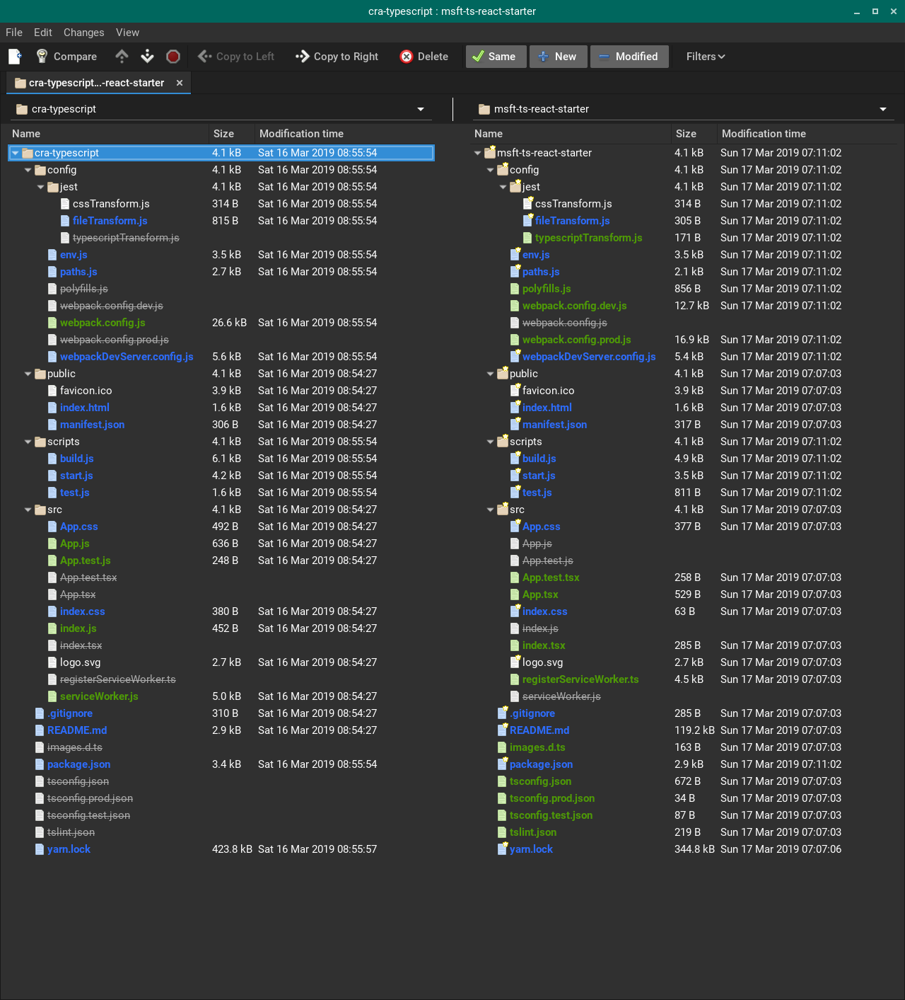

# Build Microsoft TypeScript React Starter

https://github.com/Microsoft/TypeScript-React-Starter#typescript-react-starter


Comparing
~/dev/ts/cra-typescript : ~/dev/ts/msft-ts-react-starter


```js
$ create-react-app msft-ts-react-starter --scripts-version=react-scripts-ts


$ cd msft-ts-react-starter

$ git init
$ git add --all
$ git commit -m 'initial'

$ git branch fresh-build // for safe keeping
$ code .
```

## Eject to enable compaison
```js
$ yarn eject
$ git add .
$ git commit -m 'fresh-build-ejected'
$ git branch fresh-build-ejected
```

## Compare in Meld



Comparing the package.json of the two projects, there are many differences. Too many to list here. A list of the differnces can be found [here](cra-ts.to.msft-ts-react-starter.packages-compare.htm)


## Switch to npm
```js
$ rm yarn.lock
$ rm -rf node_modules
$ npm i
```
The above change results in no changes to package.json

## Fix Vulnerabilities

npm found 38 vulnerabilities (37 low, 1 high). Let's fix them and see what changes

```js
$ npm audit fix
```

The results of that are not great. I'm guessing that using the `--force` problem can cause problems that may take lots of time to fix so going to take a pass on that. **No changes were made.**

```
fixed 0 of 38 vulnerabilities in 17786 scanned packages
  5 package updates for 38 vulns involved breaking changes
  (use `npm audit fix --force` to install breaking changes; or refer to `npm audit` for steps to fix these manually)
```

## First Test
```js
$ npm start
```

Running the app for the first time shows the older Create React App welcome page.

Create React App is always getting better whereas TypeScript-React-Starter seems to have fallen behind some. I also have pretty strong preferences on how to configure a project so I'm going to abandon this analysis and [go in a different direction]().


