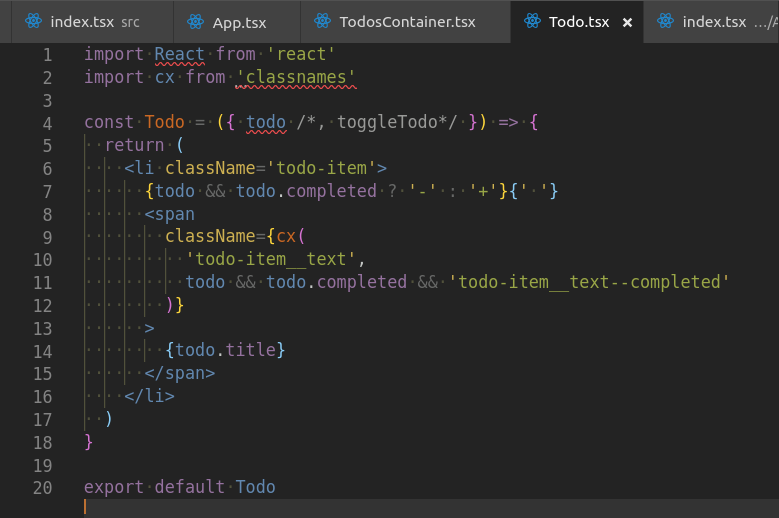
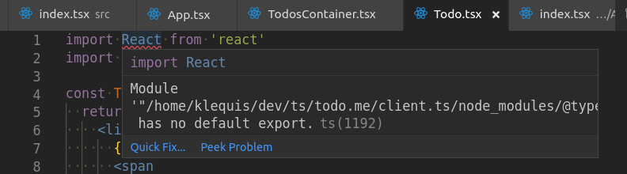
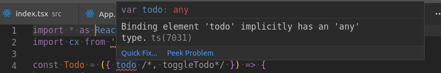
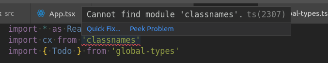
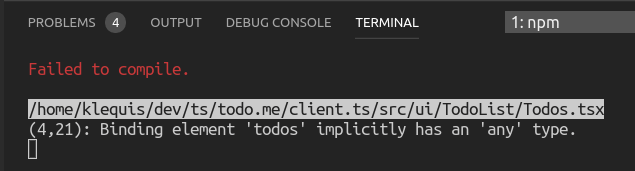
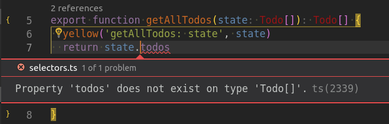
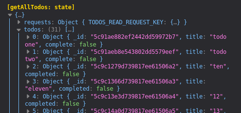

> This isn't go to go well

> __April fools__


<hr/>

**ERROR: Property 'hot' does not exist on type 'NodeModule'.**

- Add @types/webpack-env

<hr/>


<hr>

**ERror Could not find a required file.**
  **Name: index.tsx**
  **Searched in: /home/klequis/dev/ts/todo.me/client.ts/src**

- Rename src/index.js to src/index.tsx
<hr>

## Convert App.js to App.tsx

<hr>

**Error**

**/home/klequis/dev/ts/todo.me/client.ts/src/ui/App/App.tsx**

**(2,21): Cannot find module 'ui/AddTodo'.**

- Renamed /src/AddTodo/index.js & /src/App/index.js to have .tsx extension.
  - this made no difference

- **Solution** is in tsconfig.json, change
`"baseUrl": "."` to `"baseUrl": "src"`

<hr>

## Convert `src/TodoList/TodosContainer.js` to .tsx

After renameing and restarting the first error is

`
/home/klequis/dev/ts/todo.me/client.ts/src/ui/TodoList/TodosContainer.tsx`

`(10,16): Property 'todosReadRequest' does not exist on type 'Readonly<{}> & Readonly<{ children?: ReactNode; }>'.
`

However, in `TodosContainer.tsx` 'todosReadRequest()', 'todos' and 'state' all have the red squiggly underline.

<hr>

**Parameter 'state' implicitly has an 'any' type.ts(7006)**

- Change `state` to `state: any`

<hr>

**Property 'todosReadRequest' does not exist on type 'Readonly<{}> & Readonly<{ children?: ReactNode; }>'.ts(2339)**

Add

```js
interface IProps {
  todos: []
  todosReadRequest: () => void
}
```

Which says that `todos` is an array & `todosReadRequest` is a function. However, there is likely a better/more exact way to type them.

Change

```js
class TodoContainer extends React.Component {
```

to

```js
class TodoContainer extends React.Component<IProps, []> {
```

<hr/>

## Convert /src/TodoList/Todo.js to .tsx



<hr>



Solution is to change

```js
import React from 'react'
```
to
```js
import * as React from 'react
```



- Add file `src/global-types.ts`
- Add a type for Todo
```js
export type Todo = {
  _id: string,
  title: string,
  completed?: boolean,
}
```
- In src/Todo.tsx
```js
import { Todo } from 'global-types'
```
And then change ...
```js
const Todo = ({ todo }) => {
```
to
```js
const Todo = ({ todo }: { todo: Todo }) => {
```


<hr>



Solution is

```
npm i -S classnames
npm i -D @types/classnames
```

<hr>

## Convert Todos.js to .tsx

Oddly, there were not errors highlighted in the code.


But there was one in the console



This can be solved in a similar way as it was done for Todos.tsx above. However, that presents a problem. When we import Todo from global-types it creates a naming conflict with the Todo component which is also imported. To solve this, rename the Todo component to TodoItem.


```js
import { Todo } from 'global-types'
```
And then change ...
```js
const TodoList = ({ todos }) => {
```
to
```js
const TodoList = ({ todos }: { todos: Todo[] }) => {
```

## Rename `src/TodoList/index.js` with a .tsx extension.

This presents no problem.

## Convert `src/ui/AddTodo/AddTodo.js` to a .tsx extension

The only problem initially highlighted is the prop `todoAddRequest(t)`.

```js
type TProps = {
  todoAddRequest: (t) => void
}
```

Change

```js
class AddTodo extends React.Component {
```
to
```js
class AddTodo extends React.Component<TProps> {
```

After doing this there is a different error

**Parameter 't' implicitly has an 'any' type.**

Title is expecting a string so it can be type like this

```js
const t: { title: string } = {
    title: this.state.inputVal
  }
```

Also need to change
```js
type TProps = {
  todoAddRequest: (t) => void
}
```
to
```js
type TProps = {
  todoAddRequest: (t: { title: string }) => void
}
```

Which results in another error

**Parameter 'inputVal' implicitly has an 'any' type.**

So add
```js
type TState = {
  inputVal: string
}
```
And
```js
state = {
  inputVal: ''
}
```
to
```js
state: TState = {
  inputVal: ''
}
```

Again inputVal is flagged, this time as the parameter to the updateInput property

Change
```js
updateInput = (inputVal) => {
  this.setState({ inputVal })
}
```
to
```js
updateInput = (inputVal: string) => {
  this.setState({ inputVal })
}
```

That completes the conversion of AddTodo.

## actions.js to actions.ts
Next up is the conversion of `src/redux/todo/actions.ts` to `actions.js`

I have see this done different ways. One which I tried and found complex was to have an different types for each action exported from a single module, or for each type grouping of actions, say 'todo' actions or 'user' actions' export all the types. This was too complex for me to comprehend at this point so I opted for the following:

A generic action
```js
export type Action = {
  type: string,
  payload: any
}
```


Having `payload` as `any`  allows me to use this action for all actions that have only `type` & `payload`. `type` is always a string

I may at a later day specify what types `payload` can be but for now it is `any`
I'm also thinking of having a todo action type that is more specific. Let's see how things evolve.

I then used that type for an action
```js
export const todoAdd = (newTodo: Todo): Action => {
  orange('todoAdd: todo', newTodo);

  return {
    type: TODO_ADD_KEY,
    payload: newTodo,
  }
}
```

I currently have the todos reducer like this
```js
export function todosReducer(
  state: Todo[] = [],
  action: { type: string, payload: Todo[]}
): Todo[] {
  switch (action.type) {
    case TODOS_READ_KEY:
      return action.payload
    case TODO_ADD_KEY:
      return [...state, action.payload[0]]
    default:
      return state
  }
}
```

I'm wondering if I want a type for the slice of state that is Todos. Maybe
```js
type TodosSlice = Todo[]
```
But I'm not at all sure about that. I might want to use it inside of a component or a selector.


## selectors.js to selectors.ts
Convert `src/redux/todo/selectors.js` to `selectors.ts`.

There is only one selector in this file
```js
export const getAllTodos = (state) => state.todos
```

Here is my first attempt (converted to a named function for my own clarity)
```js
export function getAllTodos(state: Todo[]): Todo[] {
  return state.todos
}
```
Unfortunately, it comes with an error


One guess is that the state parameter is not an array of type Todo. Let's go back to any and see what gets passed in

```js
export function getAllTodos(state: any): any {
  yellow('getAllTodos: state', state)
  return state.todos
}
```



The state passed in is clearly an array of objects an dthose objects have the same shape as a todo. Hum ...

There was a big hint to this in the original error message
**Property** 'todos' does not exist on type 'Todo[]'. It is very clear looking at the Todo type ...
```js
export type Todo = {
  _id: string,
  title: string,
  completed?: boolean,
}
```
... that Todo[] doesn't have a property named 'todos'. Therefore, we need a type that does:
```js
type TodoState = {
  todos: Todo[]
}
```
This says that tye type `TodoState` has a property named `todos` that is an array of `Todo`. That works! It currently looks like this:
```js
import { Todo } from 'global-types'

type TodoState = {
  todos: Todo[]
}

export function getAllTodos(state: TodoState): any {
  return state.todos
}
```

But what about that return type of any? What type shoudl it be. I think it is returning an array of `Todo` so ...
```js
export function getAllTodos(state: TodoState): Todo[] {
  return state.todos
}
```
... is working.

> Will put aside the question of where `type TodoState` should live and revisit it later.

## Types?
I currently have a file named `src/redux/todo/types.js` which has not types in it. It only contains constants so rename it `constants.js`.


## Next
At this point all of `src/redux/todo/*` is typed and I'm wondering what to do next. I could do
- `src/redux/requests/*`
- `src/redux/index.js`
- `src/redux/rootReducer`
or I could move on to `src/api/*`. I think I stick with `src/redux/*` and see if I can get that fully typed.

## Requests
Most of the why and thinking aroun in the sections on typing `src/redux/todo/*` so I'm just putting the changes here unless I run into a problem.

### type RequestAction
Create in `src/global-types.ts`
```js
export const REQUEST_PENDING = 'REQUEST_PENDING'
export const REQUEST_SUCCESS = 'REQUEST_SUCCESS'
export const REQUEST_FAILURE = 'REQUEST_FAILURE'
export type RequestAction = {
  type: typeof REQUEST_SUCCESS | typeof REQUEST_PENDING | typeof REQUEST_FAILURE
  requestKey: string
  status?: typeof REQUEST_SUCCESS | typeof REQUEST_PENDING | typeof REQUEST_FAILURE
  error?: Error | null
  payload?: any
}
```
Remove the above constants from `src/redux/requests/constants.js`


### actions.ts

```js
import {
  REQUEST_PENDING,
  REQUEST_SUCCESS,
  REQUEST_FAILURE,
  RequestAction
} from 'global-types'

export const requestPending = (key: string): RequestAction => {
  return {
    type: REQUEST_PENDING,
    requestKey: key,
  }
}

export const requestSuccess = (key: string): RequestAction => {
  return ({
    type: REQUEST_SUCCESS,
    requestKey: key,
  })
}

export const requestFailed = (reason: Error, key: string): RequestAction => {
  return {
    type: REQUEST_FAILURE,
    payload: reason,
    requestKey: key,
  }
}
```

### `src/redux/requests/constants.js`
Delete this file

### `src/redux/requests/reducers.js`
```js
import {
  REQUEST_SUCCESS,
  REQUEST_PENDING,
  REQUEST_FAILURE,
  RequestAction
} from 'global-types'
import { merge } from 'ramda'

export function requestsReducer (
  state = null,
  action: RequestAction
  ) {
  switch (action.type) {
    case REQUEST_PENDING:
      return merge(state, { [action.requestKey]: { status: REQUEST_PENDING, error: null } })
    case REQUEST_SUCCESS:
      return merge(state, { [action.requestKey]: { status: REQUEST_SUCCESS, error: null } })
    case REQUEST_FAILURE:
      return merge(state, { [action.requestKey]: { status: REQUEST_FAILURE, error: action.payload } })
    default:
      return state
  }
}
```

### `src/redux/requests/selectors.ts`

What is next


